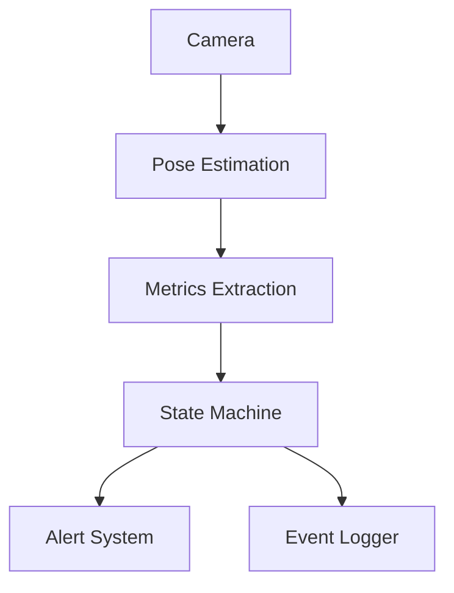

# System Architecture

This document describes the architecture of the camera-based collapse and non-recovery detection system, including design rationale and safety constraints.

---

## Architectural Overview

The system is designed as a **single-camera, real-time monitoring pipeline** that emphasizes temporal reasoning, conservative escalation, and explicit uncertainty representation.

At a high level, the system consists of:

1. Video ingestion
2. Pose estimation
3. Metric extraction
4. Temporal state modeling
5. Alerting and operator interaction
6. Audit logging

The architecture intentionally avoids end-to-end classification in favor of inspectable, deterministic components.

---

## High-Level Data Flow

---

## Core Components

### 1. Video Input
- Single fixed RGB camera
- Corridor field of view
- No assumptions of continuous visibility

---

### 2. Pose Estimation
- YOLOv8-Pose for keypoint detection
- Multi-person support
- Tracking IDs used as **hints**, not ground truth

Failures at this level are expected and explicitly handled.

---

### 3. Metric Extraction

Derived per person:
- Dual-torso angle (left/right shoulder–hip vectors)
- Bounding box aspect ratio
- Hip-to-ankle vertical compression
- Centroid velocity with time-delta clamping

Metrics are intentionally redundant to survive partial failure.

---

### 4. Temporal Reasoning Layer

Implements:
- Frame confirmation counters
- Recovery windows
- Occlusion timers
- Velocity-based collapse confirmation

This layer converts noisy observations into stable temporal signals.

---

### 5. State Machine

Each person is tracked independently using a finite state machine.

States are explicit, auditable, and never inferred implicitly.

See `STATE_MACHINE.md` for details.

---

### 6. Alert & Operator Interaction

- Alerts latch by design
- Acknowledgment separates “seen” from “resolved”
- Audio behavior reflects alert state
- Manual reset is logged

---

### 7. Event Logging

All critical events are logged to `fall_events.jsonl`:
- Fall detection
- State transitions
- Alert escalation
- Acknowledgment
- Recovery
- Manual reset

This supports post-incident review and system tuning.

---

## Architectural Constraints

- **Single camera only**
- **No medical diagnosis**
- **No silent failure modes**
- **Uncertainty increases risk**
- **Escalation preferred to suppression**

Any architectural changes must explicitly address these constraints.
