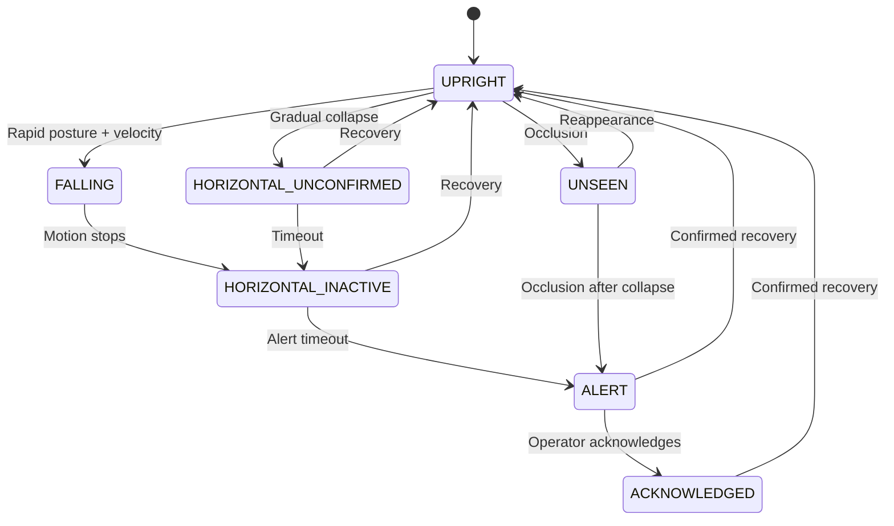

# State Machine

## Design Notes

1. **Alerts never auto-resolve silently**
2. **UNSEEN represents uncertainty explicitly**
3. **Occlusion after collapse escalates risk**
4. **Recovery requires strong evidence**
